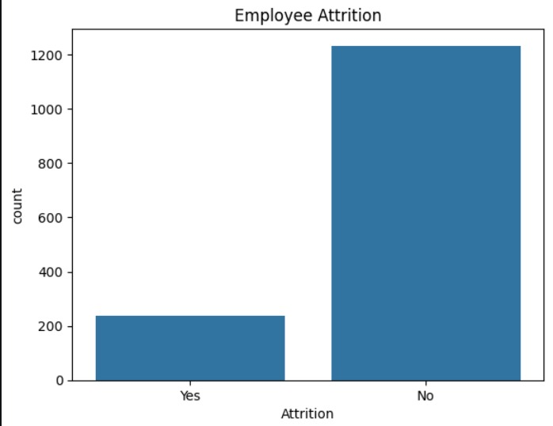
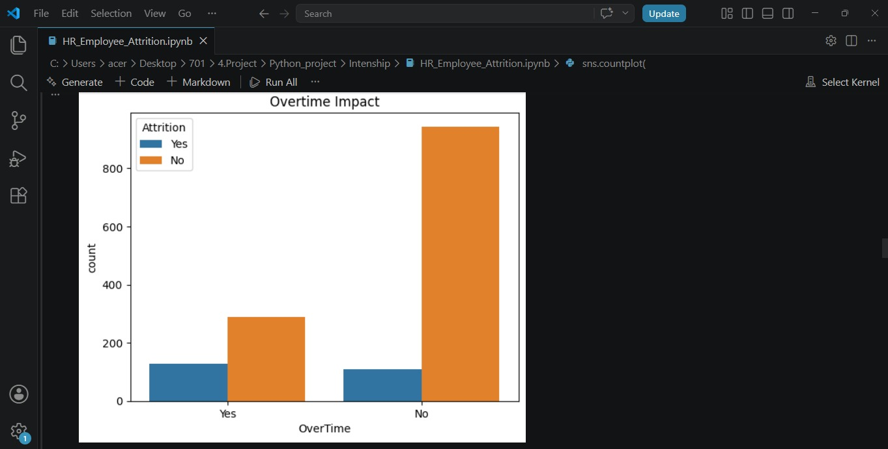
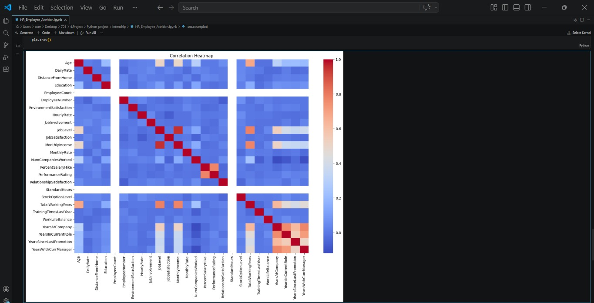
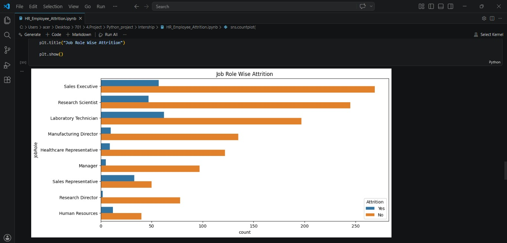

# HR Attrition Analysis

## Project Overview
This project analyzes employee attrition using the IBM HR Analytics dataset.

The objective is to identify factors that influence employee turnover and provide insights for HR decision-making.

## Technologies Used
- Python
- Pandas
- NumPy
- Matplotlib
- Seaborn
- Google Colab

## Dataset
IBM HR Employee Attrition Dataset

## Analysis Performed
## Visualizations

### Employee Attrition

### Overtime Impact

### Correlation Heatmap

### Job Role Attrition

- Attrition Distribution
- Age Analysis
- Salary Analysis
- Overtime Analysis
- Department-wise Attrition
- Job Role Analysis
- Work-Life Balance Analysis
- Correlation Heatmap

## Key Insights
- Employees working overtime showed higher attrition.
- Salary impacts employee retention.
- Certain job roles experienced higher attrition.
- Work-life balance affects employee satisfaction and retention.

## Project Outcome
The project helps HR teams understand employee turnover patterns and supports workforce planning.

## Author
ArunKumar
